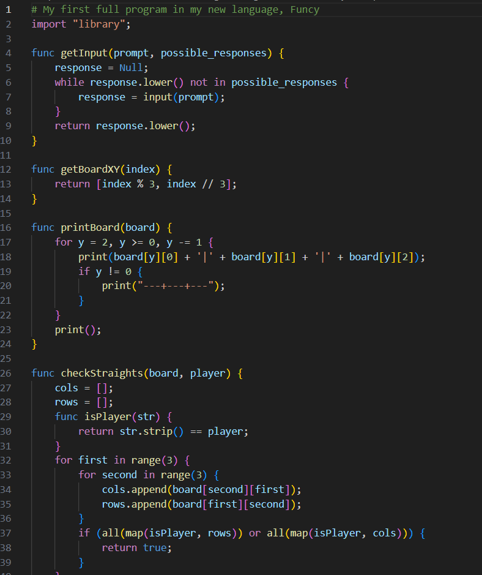

# Funcy Syntax Highlighting Extension for Visual Studio Code

This extension provides syntax highlighting for the Funcy programming language. Funcy is a simple interpreted language that is meant to be a mix between the languages Python and C++.

## Features

The syntax highlighting includes:
- Keywords
- Strings
- Comments
- Block Comments
- Numbers
- Variables
- Functions

## Installing
In order to use this extension, you must first package the extension and then apply it in VSCode.

### 1. Install vsce

vsce (Visual Studio Code Extensions) is a command-line tool to package and publish extensions.

Install vsce globally using npm:

    npm install -g vsce

> Tip: If you cannot run npm, you likely need to download `Node.js`

### 2. Package The Extension

To package the extension:

Navigate to the root directory of the extension where the package.json file is located.
Run the following command:

    vsce package

This command will generate a .vsix file (e.g., my-extension-0.0.1.vsix). This file is the packaged version of your extension.

### 3. Install The Extension Locally

In VSCode, press Ctrl+Shift+P (or Cmd+Shift+P on Mac) to open the Command Palette.
Type Extensions: Install from VSIX....
Select the .vsix file you generated earlier.